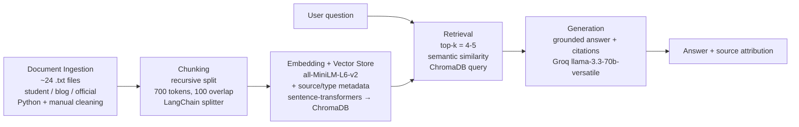

# Project 1 Planning: The Unofficial Guide

> Write this document before you write any pipeline code.
> Your spec and architecture diagram are what you'll use to direct AI tools (Claude, Copilot, etc.) to generate your implementation — the more specific they are, the more useful the generated code will be.
> Update the Retrieval Approach and Chunking Strategy sections if you change your approach during implementation.
> Update this file before starting any stretch features.

---

## Domain <!-- What domain did you choose? Why is this knowledge valuable and hard to find through official channels? -->

For my domain, I chose to focus on the unofficial student knowledge such as careers, classes, and competitiveness of UT Austin's overlapping tech majors: CS, SDS, MIS, and Informatics. The knowledge is all across tons of Reddit threads and admissions blogs where students and counselors argue, contradict and also share the main thing. It's nearly impossible to find information like this through actual official channels which list course requirements but don't tell you whether MIS is respected or what your actual odds at CS admission are. 

While I also included some official major coursework and summaries, I feel this is the best way for students to get a complete picture of their major: competitiveness and career advantages, that they might not have gotten otherwise. On official webpages, they just focus on the major and some career paths without showing the true overall picture of the major. 

When I was considering what to apply at UT, this would have helped me.

---

## Documents

<!-- List your specific sources: URLs, subreddit names, forum threads, or file descriptions.
     Aim for at least 10 sources that together cover different subtopics or perspectives within your domain. -->

## Documents

| # | Source | Description | URL or location |
|---|--------|-------------|-----------------|
| 1 | texadmissions.com (blog) | Counselor blog arguing UT CS is highly competitive; suggests alternative majors | https://www.texadmissions.com/blog/2025/6/5/ut-austin-computer-science-is-highly-competitive-consider-these-alternatives |
| 2 | r/UTAustin (student) | What upper-division MIS classes are actually like | https://www.reddit.com/r/UTAustin/comments/jmwxll/what_are_upperdivision_mis_classes_like/ |
| 3 | r/UTAustin (student) | MIS compared against other majors | https://www.reddit.com/r/UTAustin/comments/1glze40/question_about_mis_vs_other_majors/ |
| 4 | r/UTAustin (student) | General opinions on the MIS major | https://www.reddit.com/r/UTAustin/comments/sqknkh/how_is_the_mis_major/ |
| 5 | r/UTAustin (student) | Opinions on choosing MIS as a major | https://www.reddit.com/r/UTAustin/comments/unqi9n/opinions_on_mis_for_major/ |
| 6 | r/UTAustin (student) | Favorite MIS courses (coursework detail) | https://www.reddit.com/r/UTAustin/comments/j56nxf/favorite_mis_course_youve_taken/ |
| 7 | r/UTAustin (student) | Direct comparison: CS vs MIS vs ECE | https://www.reddit.com/r/UTAustin/comments/vkrjsp/cs_vs_mis_vs_ece/ |
| 8 | r/UTAustin (student) | Whether to rethink committing to UT CS | https://www.reddit.com/r/UTAustin/comments/1r56jfc/should_i_rethink_going_to_ut_cs/ |
| 9 | r/UTAustin (student) | Honest student review of UT's CS program | https://www.reddit.com/r/UTAustin/comments/mr4igd/cs_majors_can_you_give_me_an_honest_review_of_uts/ |
| 10 | r/UTAdmissions (student) | Lowest stats seen admitted to UT CS (competitiveness data points) | https://www.reddit.com/r/UTAdmissions/comments/1c7hynv/lowest_stats_youve_seen_get_into_ut_cs/ |
| 11 | r/UTAustin (student) | How good UT's CS program is (quality/reputation) | https://www.reddit.com/r/UTAustin/comments/1dtbxob/how_good_is_uts_computer_science_program/ |
| 12 | r/UTAdmissions (student) | Applicant aiming for UT CS; admissions discussion | https://www.reddit.com/r/UTAdmissions/comments/pptu12/i_really_want_to_get_into_ut_cs_its_my_dream/ |
| 13 | r/UTAdmissions (student) | How to increase chances of UT CS admission | https://www.reddit.com/r/UTAdmissions/comments/1h9995v/how_does_one_increase_their_chances_of_ut_cs/ |
| 14 | r/UTAdmissions (student) | How competitive SDS is and how hard to get in | https://www.reddit.com/r/UTAdmissions/comments/1qkg5r6/how_comp_is_ut_sds_and_how_hard_to_get_in/ |
| 15 | r/UTAustin (student) | Admitted SDS student's questions (experience/coursework) | https://www.reddit.com/r/UTAustin/comments/1il3e7f/i_got_in_for_sds_but_i_have_some_questions/ |
| 16 | r/UTAustin (student) | Comparison: UT SDS vs UTD CS | https://www.reddit.com/r/UTAustin/comments/1iprdv3/ut_sds_vs_utd_cs/ |
| 17 | r/UTAustin (student) | SDS major coursework breakdown | https://www.reddit.com/r/UTAustin/comments/1jmny50/statistics_and_data_science_major_coursework/ |
| 18 | r/UTAustin (student) | Concerns the School of Information is declining | https://www.reddit.com/r/UTAustin/comments/1ouikev/the_school_of_information_is_on_its_way_out/ |
| 19 | texadmissions.com (blog) | Explainer of UT's new Informatics degree in the iSchool | https://www.texadmissions.com/blog/2021/04/27/ut-austin-announces-new-degree-bachelors-in-informatics-in-the-ischool |
| 20 | r/UTAustin (student) | Opinions on the Informatics major at UT | https://www.reddit.com/r/UTAustin/comments/rq94p0/informatics_major_in_university_of_texas_at_austin/ |
| 21 | catalog.utexas.edu (official) | Official MIS degree plan (BBA) — required coursework | https://catalog.utexas.edu/undergraduate/business/degrees-and-programs/bachelor-of-business-administration/management-information-systems/ |
| 22 | catalog.utexas.edu (official) | Official Informatics degree plan (BS, iSchool) — required coursework | https://catalog.utexas.edu/undergraduate/information/degrees-and-programs/bachelor-of-science/ |
| 23 | catalog.utexas.edu (official) | Official Computer Science degree plan (BS) — required coursework | https://catalog.utexas.edu/undergraduate/natural-sciences/degrees-and-programs/bs-computer-science/ |
| 24 | catalog.utexas.edu (official) | Official Statistics & Data Sciences degree plan (BS) — required coursework | https://catalog.utexas.edu/undergraduate/natural-sciences/degrees-and-programs/bs-statistics-and-data-sciences/ |

## Chunking Strategy

<!-- How will you split documents into chunks?
     State your chunk size (in tokens or characters), overlap size, and explain why those
     numbers fit the structure of your documents.
     A review-heavy corpus warrants different chunking than a long FAQ. -->

**Chunk size:** 700 tokens

**Overlap:** 100 tokens (14%)

**Reasoning:** My information has either short multi-voice Reddit forum threads and long, densely structured catalog degree pages. I use recursive chunking, which splits on the largest natural boundary first (paragraphs, then sentences, then characters), so it breaks between comments/paragraphs before ever cutting mid-sentence, important for messy forum text.I chose 700 tokens as a deliberate compromise between the two shapes: large enough to keep a substantive student comment or a block of catalog requirements intact, but small enough to avoid fusing several contradictory student opinions into one diluted embedding (which would hurt queries like "is MIS respected?"). I accept this is optimal for neither extreme, very short replies may be grouped with neighbors, and long catalog sections may split across a boundary, and I use 100-token overlap (~14%) so a thought that spills across a chunk boundary stays recoverable without over-duplicating content.

---

## Retrieval Approach

<!-- Which embedding model are you using (e.g., all-MiniLM-L6-v2 via sentence-transformers)? 
     How many chunks will you retrieve per query (top-k)?
     If you were deploying this for real users and cost wasn't a constraint, what tradeoffs
     would you weigh in choosing a different embedding model — context length, multilingual
     support, accuracy on domain-specific text, latency? -->

**Embedding model:** All-MiniLM-L6-v2​ sentence-transformers because it runs locally with no API key, no rate limits. It's small and fast to embed a bunch of thousand chunks on a laptop in a second and it is good for short English text.

**Top-k:**  Top-k is how many chunks you send.  I am thinking around 4 chunks. Because 4 chunks are enough to show a spread of opinions but also few enough to keep the context focused and chunks are already large. Starting point, will tune after seeing real retrieval results.

**Production tradeoff reflection:**
MiniLM is general-purpose. A bigger model (e.g., OpenAI's text-embedding-3-large or a larger open model like bge-large) has better semantic distinctions, which would help with  jargon-dense, opinion-nuanced text where "MIS is a backup" and "MIS is underrated" are  different stances. MiniLM truncates at 256 tokens. Mychunks are 700 tokens, so MiniLM only "sees" the first 256 and silently ignores the rest of every chunk. A longer-context embedding model would actually embed my whole chunk. 

---

## Evaluation Plan

<!-- List your 5 test questions with their expected correct answers.
     Questions should be specific enough that you can judge whether the system's response
     is right or wrong. "What are good dining halls?" is too vague.
     "What do students say about wait times at [dining hall name] during lunch?" is testable. -->

| # | Question | Expected answer |
|---|----------|-----------------|
| 1 |How competitive is direct admission to UT CS, and what do students say about realistic odds? | Students describe it as extremely competitive / among the hardest CS admits; many strong applicants get rejected; common advice is to apply to a second-choice major or plan an internal transfer.  |
| 2 | What career outcomes or job paths do students associate with the MIS major? (MIS opinion threads) | Product Management, Tech consulting, analytics |
| 3 | When UT students compare CS, MIS, and ECE for someone wanting "software with business," what do they recommend?| The dominant advice is to major in CS (or ECE) and add business via a minor/certificate, rather than majoring in MIS — multiple commenters argue CS is more lucrative and flexible, that a CS major + business minor beats a business major + computing certificate, and several note people who say they want the "intersection of business and tech" usually end up as software engineers anyway. Recurring specifics you can verify: the Elements of Computing certificate as the add-on for MIS students, and ECE being "only hardware-focused if you want it to be."|
| 4 | What do students say about the difficulty of SDS coursework and whether you need prior coding experience? |  Students describe SDS classes as not especially hard but coding-heavy — freshman courses are "pretty easy" and get harder sophomore year but stay doable. Prior coding experience isn't required (the fall freshman course teaches R), though lightly brushing up on Python beforehand is suggested. Verifiable specifics: you'll take intro Python and R, and a MacBook works fine for the required programs.|
| 5 |What do students say about UT's Informatics program and job prospects for it? |A current student strongly recommends transferring in and is positive about the program — it's small (~100 undergrads at the time, mostly freshmen), new (launched Fall 2021), so students and professors know each other and there's room to get involved. On jobs: she frames Austin as a booming tech city ("number one in growth for jobs"), notes informatics jobs are growing, but is candid that the field is so new people don't always know it exists, and that she (a junior) hadn't landed an internship yet — while reassuring that's common and fine. Verifiable specifics: launched Fall 2021, ~100 students, health informatics + UX concentration, Austin tech-job optimism tempered by "the field is new." |

---

## Anticipated Challenges

<!-- What could go wrong? Name at least two specific risks with reasoning.
     Consider: noisy or inconsistent documents, missing source attribution, off-topic
     retrieval, chunks that split key information across boundaries. -->

1. Boilerplate contamination from scraped Reddit pages. Every saved thread carries the same junk,  "Skip to main content," Adobe/AT&T/Upwork promoted ads, a "best study spots" blob that isn't even about UT (it names Langston and EJ Pratt libraries from another school), and a long trailing list of unrelated subreddit links (r/banjo, r/UIUC, r/Disneycollegeprogram). If cleaning doesn't strip all of it, these chunks get embedded and retrieved, so a query about CS could surface a banjo thread or study-spot advice, tanking relevance.

2. An answer to one question is scattered across multiple commenters. In the SDS thread, the full "how hard is it / do I need coding experience" answer is split between DiscoBobulater and Dangerous-Basil1561. My 700-token chunks keep each comment intact, but no single chunk holds the complete picture, so retrieval depends on top-k pulling several chunks, and if k is too low or the chunks rank unevenly, the system returns a partial answer.

---

## Architecture

<!-- Draw a diagram of your pipeline showing the five stages:
     Document Ingestion → Chunking → Embedding + Vector Store → Retrieval → Generation
     Label each stage with the tool or library you're using.
     You can use ASCII art, a Mermaid diagram, or embed a sketch as an image.
     You'll use this diagram as context when prompting AI tools to implement each stage. -->

---

## AI Tool Plan

<!-- For each part of the pipeline below, describe:
     - Which AI tool you plan to use (Claude, Copilot, ChatGPT, etc.)
     - What you'll give it as input (which sections of this planning.md, which requirements)
     - What you expect it to produce
     - How you'll verify the output matches your spec

     "I'll use AI to help me code" is not a plan.
     "I'll give Claude my Chunking Strategy section and ask it to implement chunk_text()
     with my specified chunk size and overlap" is a plan. -->

**Milestone 3 — Ingestion and chunking:**

Claude. Input: my Documents table, my Chunking Strategy section (recursive, 700 tokens,
100 overlap), and a note that my files have two shapes (short multi-voice Reddit threads + long
catalog pages) plus the specific boilerplate to strip (nav text, promoted ads, "People also ask"
block, trailing subreddit links). I'll ask it to write a script that loads every .txt from
/documents, removes that boilerplate, chunks recursively at my size/overlap, and tags each chunk
with source filename + type (student/blog/official). Verify: print 5 random chunks and confirm
each is one coherent unit, metadata is correct, and no ads/nav/HTML remain.

**Milestone 4 — Embedding and retrieval:**

Tool: Claude. Input: my Retrieval Approach section + architecture diagram. I'll ask it to embed
all chunks with all-MiniLM-L6-v2, store them in ChromaDB with metadata, and write a top-k
retrieval function returning chunks + source + distance scores. Verify: run 3 of my eval
questions (CS/MIS/ECE, SDS difficulty, Informatics), print returned chunks and distances, and
confirm results are on-topic with distances below ~0.5 before wiring in generation.

**Milestone 5 — Generation and interface:**

Tool: Claude. Input: my grounding requirement (answer from retrieved context only; say "I don't
have enough information" otherwise), desired output format (answer + source list), and the Gradio
skeleton. I'll ask it to wire retrieval → Groq LLM → response with source attribution added
programmatically, not left to the model. Verify: test an in-corpus question (must cite a real
source file) and an out-of-scope question (must refuse), and check a contested question surfaces
both sides rather than one.